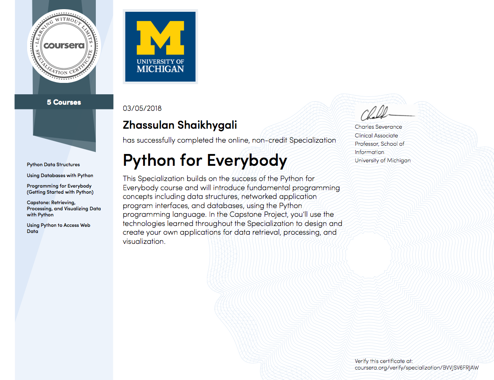

# Python for Everybody Specialisation

## Details on Specialisation
This specialisation is by the University of Michigan on Coursera consisting of 4 courses and 1 capstone project.

### Assignment Answers
The answers are entirely created by me. They are not the same as the suggested ones. However, they produce the same results and are roughly similar. Moreover, there are inline notes to help you to understand each step.

### Additional Lecture Notes
I created python files on the go when I watched the lectures to document every important point that requires typing code. You will find this very useful when you need help in your assignments.

### File names
If the file ends with _p2, this means that the file runs on Python 2.  
If the file ends with _p3, this means that the file runs on Python 3.  
I tried to create two versions. However, you can easily modify the syntax accordingly. Mostly it's due to the print syntax.

### Inline Notes
The notes are in the python files explaining each step with extra notes on what to avoid and what to take note of for that particular script.

### Links to Coursera Courses by the University of Michigan
<a href="https://www.coursera.org/specializations/python">Specialisation</a> 
1. <a href="https://www.coursera.org/learn/python">Getting Started with Python</a> 
2. <a href="https://www.coursera.org/learn/python-data">Python Data Structures</a> 
3. <a href="https://www.coursera.org/learn/python-network-data">Using Python to Access Web Data</a> 
4. <a href="https://www.coursera.org/learn/python-databases">Using Databases with Python</a>

### Awesome Lecturer
Without him, I would not have been able to create these notes and answers. 
Professor Charles Severance, University of Michigan.

